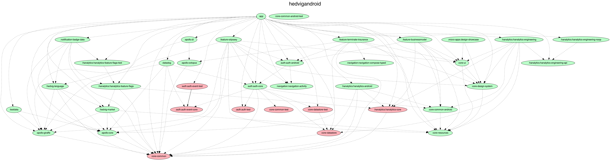

# Hedvig app for Android

## Develop

1. Acquire Lokalise credentials (you can find them in 1Password), place in the following file:
    - `lokalise.properties`
2. Acquire gradle.properties which contain a token for Github Packages authentication. 
   Generate your own at GitHub > Settings > Developer Settings > PAT > Tokens (Classic) > Generate New Token > Give the read:packages permission    
   Append (or create) your global gradle.properties in:
    - `~/.gradle/gradle.properties`
   Look inside [ci-prebuild](scripts/ci-prebuild.sh) for inspiration.
3. Download the schema (required to consume any changes in schema as well):
    `./gradlew downloadOctopusApolloSchemaFromIntrospection`
4. Download lokalise translations (required to consume latest translations as well):
    `./gradlew downloadStrings`
5. Build and install via Android Studio

## Formatting

Formatting is handled with ktlint with extra configuration defined in [`.editorconfig`](.editorconfig)
run `./gradlew ktlintCheck` to check that the files follow the rules
run `./gradlew ktlintFormat` to make ktlint to format all files according to the rules 

## Build Types

* Release: `com.hedvig.app` Build for the customer on Play Store. Using production backend
* Staging: `com.hedvig.app` Build for internal testing using Firebase App Distribution. Using staging backend
* Develop: `com.hedvig.dev.app` Build for development. Using staging backend

## Module structure

Generated from `./gradlew :generateProjectDependencyGraph`*\
*Note that this requires `dot` from graphviz to be on your path. Run `brew install graphviz`

## Renovate

`renovate.json` is a file which Renovate looks at in order to be able to suggest upgrading private artifacts to their latest version.
The `username` used in there is the result of passing our jitpack username (from 1Password) through Renovate's [website](https://app.renovatebot.com/encrypt) to get the hashed version of it.

## Removing unused resources

The [android-remove-unused-resources-plugin](https://github.com/irgaly/android-remove-unused-resources-plugin/tree/main#usage)
plugin is used to achieve this. This will run on CI using [this task](./.github/workflows/unused-resources.yml), but to run locally one can also just do
`./gradlew :app:lint -Prur.lint.onlyUnusedResources`
And then
`./gradlew :app:removeUnusedResourcesDebug`