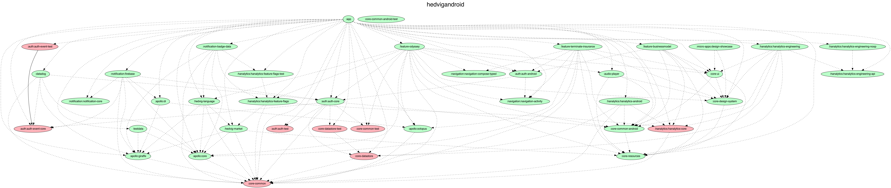

# Hedvig app for Android

## Develop

1. Acquire Adyen credentials (you can find them in 1Password), place in the following paths:
    - `app/src/${debug|staging|release}/res/values/adyen.xml`
2. Acquire Lokalise credentials (you can find them in 1Password), place in the following file:
    - `lokalise.properties`
3. Acquire Mixpanel credentials (you can find them in 1Password), place in the following paths:
    - `app/src/${debug|staging|release}/res/values/mixpanel.xml`
4. Acquire Shake credentials (you can find them in 1Password), place in the following paths:
    - `app/src/${debug|staging}/res/values/shake.xml`
5. Acquire gradle.properties which contain a token for jitpack authentication (you can find them in 1Password), 
   append (or create) your global gradle.properties in:
    - `~/.gradle/gradle.properties`
6. Download the schema (required to consume any changes in schema as well):
```bash
$ ./gradlew :apollo:downloadGiraffeApolloSchemaFromIntrospection
```
7. Download lokalise translations (required to consume latest translations as well):
```bash
$ ./gradlew core-resources/downloadStrings
```
8. Build and install via Android Studio

## Formatting

Formatting is handled with ktlint with extra configuration defined in [`.editorconfig`](.editorconfig)
run `./gradlew ktlintCheck` to check that the files follow the rules
run `./gradlew ktlintFormat` to make ktlint to format all files according to the rules 

## Build Types

* Release: `com.hedvig.app` Build for the customer on Play Store. Using production backend
* Staging: `com.hedvig.test.app` Build for internal testing using Firebase App Distribution. Using staging backend
* Develop: `com.hedvig.dev.app` Build for development. Using staging backend

## Module structure



Generated from `./gradlew :generateProjectDependencyGraph`*\
*Note that this requires `dot` from graphviz to be on your path. Run `brew install graphviz`
