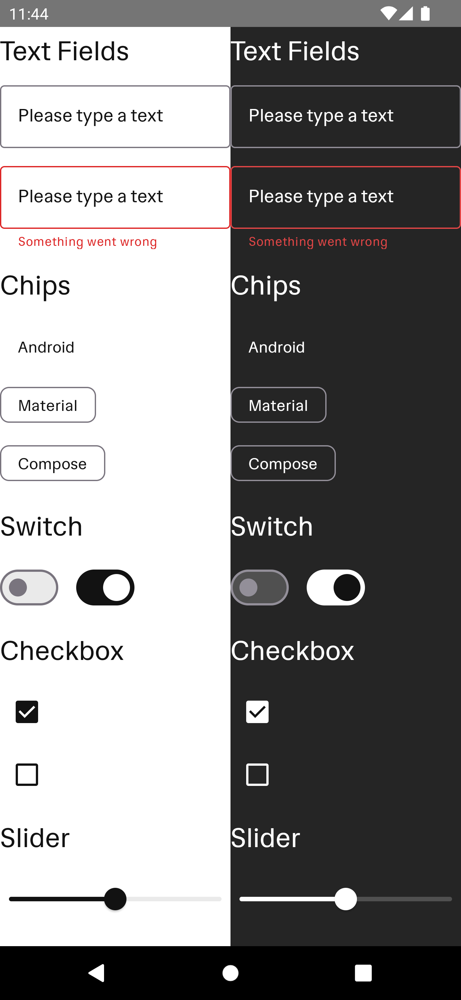

## A micro app to quickly test core-design-system and core-ui components

### Made test how the m3 design system color mapping works in various m3 components

Run quickly by using the shared run configuration `Design Showcase`

